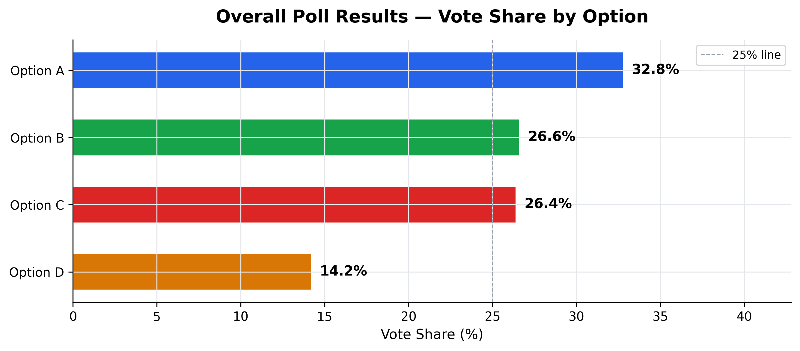
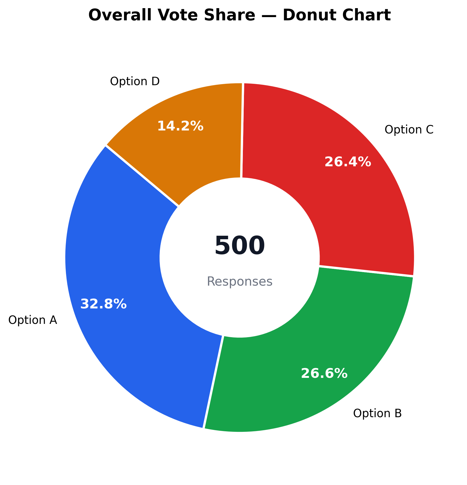
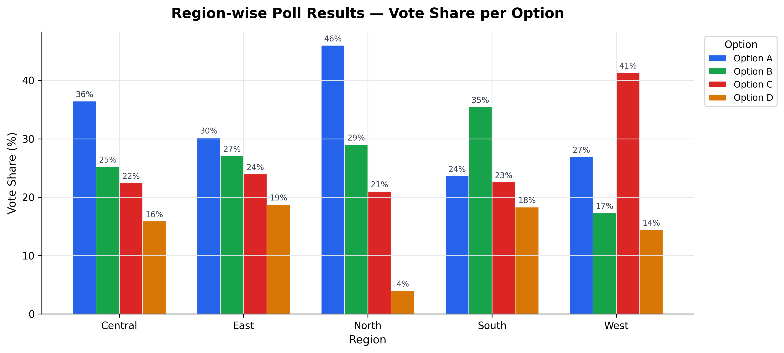
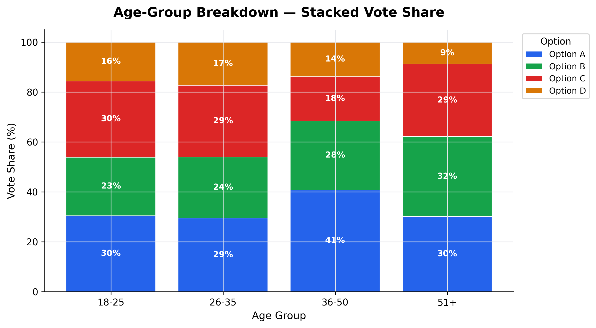
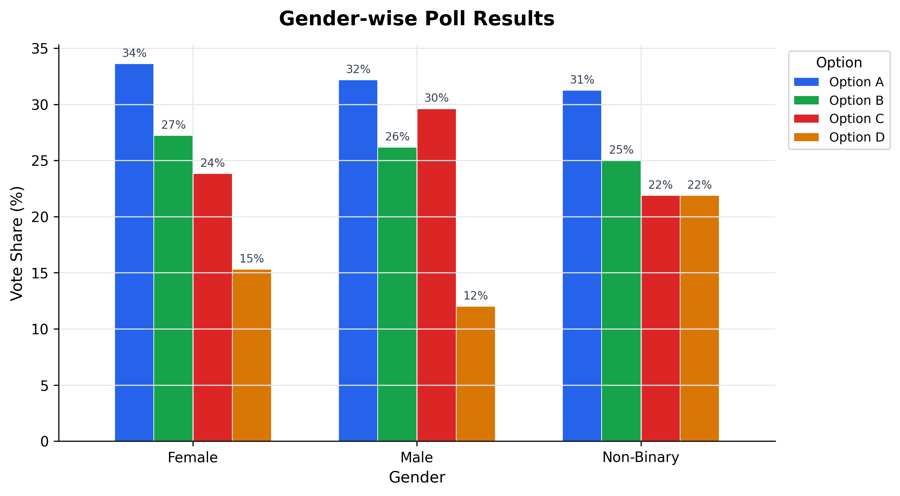
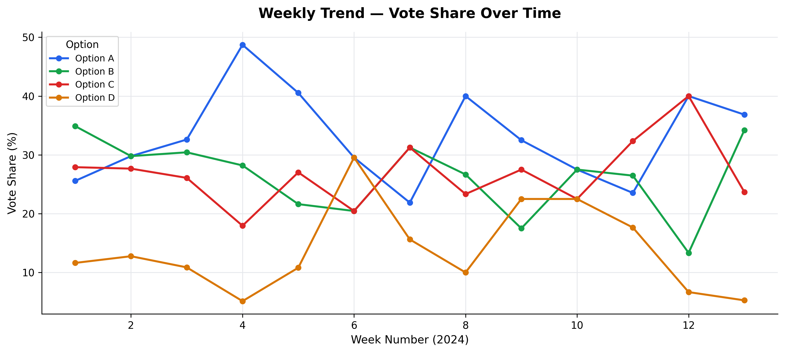
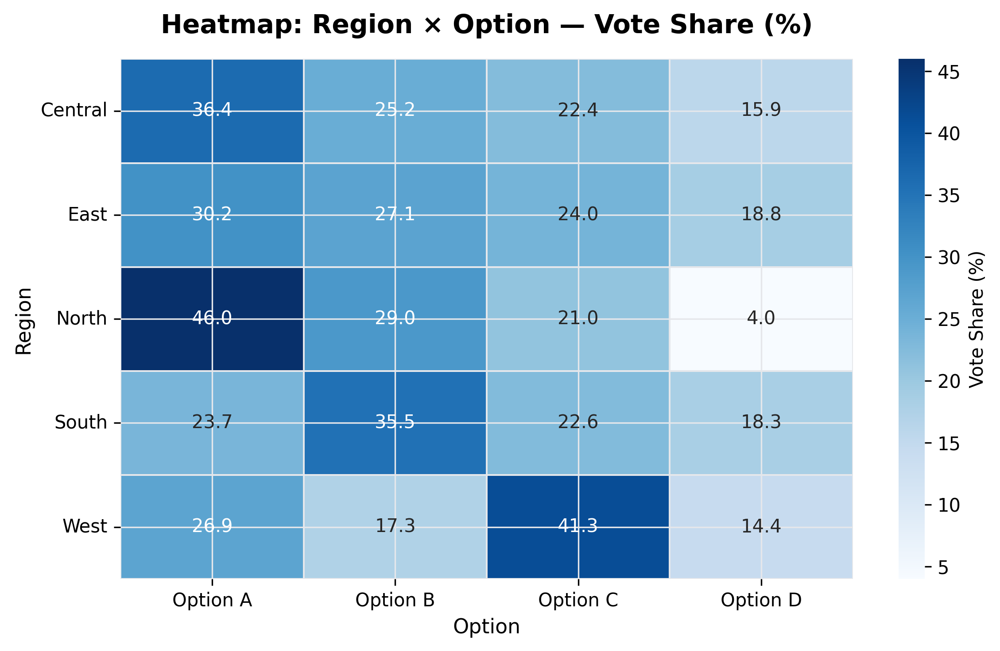

# 📊 Poll Results Visualizer

> **End-to-end survey data analysis pipeline** — from synthetic data generation through cleaning, statistical analysis, and multi-dimensional visualization.

---

## 🧭 Overview

Poll Results Visualizer is a complete data analytics project that simulates how organizations process and analyze poll and survey data. It covers the full analyst workflow:

```
Raw Poll Data → Preprocessing → Analysis → Visualization → Insights
```

Built as a portfolio project targeting **Data Analyst**, **Business Analyst**, **Research Analyst**, and **Insights Analyst** roles.

---

## ❓ Problem Statement

Organizations collect hundreds or thousands of poll responses across different regions, age groups, and demographic segments. The raw data alone tells you nothing — you need a repeatable pipeline to clean it, segment it, visualize it, and extract actionable insights. This project builds exactly that.

---

## ✅ Solution

A modular Python pipeline that:
- **Generates** realistic synthetic poll data (500 respondents, 5 regions, 4 age groups)
- **Cleans** the data (handles nulls, standardises formats, adds time features)
- **Analyses** vote shares across 6 demographic dimensions
- **Visualizes** results across 7 chart types
- **Reports** key insights automatically

---

## 🗂️ Project Structure

```
Poll-Results-Visualizer/
│
├── data/
│   ├── poll_data.csv              ← Raw generated dataset
│   └── poll_data_clean.csv        ← Cleaned, feature-engineered dataset
│
├── notebooks/
│   └── poll_analysis.ipynb        ← Full walkthrough notebook
│
├── src/
│   ├── generate_data.py           ← Synthetic data generator
│   ├── clean_data.py              ← Data cleaning & preprocessing
│   ├── analyze.py                 ← Statistical analysis & insights
│   └── visualize.py               ← All 7 chart generators
│
├── outputs/
│   ├── chart1_overall_bar.png
│   ├── chart2_donut.png
│   ├── chart3_region_grouped.png
│   ├── chart4_age_stacked.png
│   ├── chart5_gender.png
│   ├── chart6_weekly_trend.png
│   └── chart7_heatmap.png
│
├── images/                        ← Screenshots for README
├── main.py                        ← One-command full pipeline runner
├── requirements.txt
└── README.md
```

---

## 🛠️ Tech Stack

| Category | Tool |
|---|---|
| Language | Python 3.10+ |
| Data Manipulation | Pandas, NumPy |
| Visualization | Matplotlib, Seaborn |
| Interactive Charts | Plotly (optional) |
| Notebook | Jupyter |
| Version Control | Git + GitHub |

---

## ⚙️ Installation & Setup

### 1. Clone the repository
```bash
git clone https://github.com/Anupam-Santra/poll-results-visualizer.git
cd poll-results-visualizer
```

### 2. Create a virtual environment
```bash
# Windows
python -m venv venv
venv\Scripts\activate

# Mac / Linux
python3 -m venv venv
source venv/bin/activate
```

### 3. Install dependencies
```bash
pip install -r requirements.txt
```

---

## 🚀 How to Run

### Option A — Full pipeline (one command)
```bash
python main.py
```

This runs all 4 stages automatically:
1. Generate synthetic dataset → `data/poll_data.csv`
2. Clean and preprocess → `data/poll_data_clean.csv`
3. Print analysis report
4. Generate all 7 charts → `outputs/*.png`

### Option B — Run individual modules
```bash
python src/generate_data.py   # Step 1: create dataset
python src/clean_data.py      # Step 2: clean it
python src/analyze.py         # Step 3: print analysis
python src/visualize.py       # Step 4: generate charts
```

### Option C — Jupyter Notebook
```bash
jupyter notebook notebooks/poll_analysis.ipynb
```

---

## 📊 Dataset Description

The synthetic dataset simulates poll responses with realistic regional and demographic biases.

| Column | Type | Description |
|---|---|---|
| `respondent_id` | string | Unique ID (R0001–R0500) |
| `date` | datetime | Response date (Jan–Mar 2024) |
| `question` | string | Poll question text |
| `selected_option` | string | Option A / B / C / D |
| `region` | string | North / South / East / West / Central |
| `age_group` | categorical | 18-25 / 26-35 / 36-50 / 51+ |
| `gender` | string | Male / Female / Non-binary |
| `education` | string | High School / Bachelor's / Master's / PhD |
| `employment` | string | Employed / Student / Self-employed / Unemployed |
| `week` | int | ISO week number (derived) |
| `month` | string | Month name (derived) |

**Intentional noise:** ~2% of `selected_option` values are set to `NaN` to simulate real-world missing data — handled via region-wise mode imputation.

---

## 📈 Charts Generated

| # | Chart | Insight |
|---|---|---|
| 1 | Horizontal bar — overall vote share | Which option leads overall |
| 2 | Donut chart — overall vote share | Visual proportion split |
| 3 | Grouped bar — region-wise | How regions differ |
| 4 | Stacked bar — age-group | How age affects preference |
| 5 | Clustered bar — gender | Gender-based comparison |
| 6 | Multi-line trend — weekly | How support changed over time |
| 7 | Heatmap — region × option | Full cross-dimensional view |

---

## 🔍 Key Findings

- **Option A** leads overall with **32.8%** of total votes (164 / 500 respondents)
- **North region** shows strongest support for Option A at 46%
- **West region** uniquely favours Option C (41.35%) — notable regional divergence
- **Older voters (36–50)** lean more toward Option A; younger voters (18–35) are more evenly distributed
- **Option D** is consistently the least preferred across all demographic segments
- Weekly trend shows stable leads for Option A throughout the Jan–Mar 2024 survey period

---

## 🧹 Data Cleaning Steps

1. **Duplicate removal** — drop rows with duplicate `respondent_id`
2. **Null imputation** — fill missing `selected_option` using region-wise mode
3. **Text standardisation** — strip whitespace, apply `.title()` casing
4. **Date parsing** — convert string dates to `datetime64`
5. **Feature engineering** — add `week` and `month` columns
6. **Categorical encoding** — age group as ordered `pd.Categorical`

---

## 📁 Output Files

After running the pipeline, the `outputs/` folder contains:

```
outputs/
  chart1_overall_bar.png       ← Horizontal bar chart
  chart2_donut.png             ← Donut chart
  chart3_region_grouped.png    ← Region comparison
  chart4_age_stacked.png       ← Age stacked bar
  chart5_gender.png            ← Gender clustered bar
  chart6_weekly_trend.png      ← Trend line chart
  chart7_heatmap.png           ← Region × Option heatmap
```
---
## Visual Analysis Results

### Overall Distribution
| Primary Results | Participation Breakdown |
| :---: | :---: |
|  |  |
| *Horizontal Bar Chart* | *Donut Distribution* |

### Demographic & Regional Insights
* **Regional Comparison:**
  
* **Age & Gender Analysis:**
  
  

### Trends & Correlations
* **Weekly Trend:**
  
* **Regional Heatmap (Option vs Region):**
  
---

## 🔮 Future Improvements

- [ ] **Streamlit dashboard** — interactive web app with live filters
- [ ] **Plotly charts** — fully interactive hover-enabled charts
- [ ] **Sentiment analysis** — NLP on open-ended responses
- [ ] **Power BI / Tableau export** — `.pbix` / `.twbx` dashboard files
- [ ] **Real data integration** — Google Forms CSV export compatibility
- [ ] **Statistical tests** — Chi-square tests for demographic significance
- [ ] **PDF report generation** — auto-generated summary report

---

## 🎤 Interview Talking Points

**"Walk me through your project"**
> "I built an end-to-end poll analysis pipeline in Python. I generated a realistic 500-row synthetic dataset with regional and demographic biases, cleaned it using Pandas — including null imputation via regional mode — then produced 7 visualizations covering overall vote share, regional breakdowns, age and gender comparisons, trend analysis, and a heatmap. The key finding was Option A leading with 32.8%, with notable regional divergence in the West."

**"Why did you use mode imputation instead of dropping null rows?"**
> "Dropping rows loses information. Since missing values were random (~2%), mode imputation by region preserved the regional distribution patterns in the data, which is more appropriate than global mode or mean imputation for categorical variables."

**"What's the difference between a grouped bar and a stacked bar?"**
> "Grouped bars make it easier to compare absolute values across categories within the same group. Stacked bars show the part-to-whole relationship — ideal when the 100% composition matters more than the individual absolute counts."

---

## 👤 Author

**Your Name**  
Data Analyst | Python · Pandas · SQL · Visualization  
[LinkedIn](https://www.linkedin.com/in/anupam-santra-615832277/) · [GitHub](https://github.com/Anupam-Santra)

---

## 📄 License

This project is open source under the [MIT License](LICENSE).
